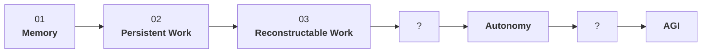

# Denis Hignyak

**Systems Architect & 0→1 Systems Builder**

I design systems by changing the architecture around a problem rather than simply optimizing existing components.

My work sits at the intersection of product, operations, and AI systems. I work primarily at the architecture level and use rapid AI-assisted development to turn concepts into working MVPs and test them in practice.

## 0→AGI

I am building **0→AGI** — a public architectural experiment toward long-lived autonomous AI systems.

**Working hypothesis:** a significant part of the remaining path toward autonomous AGI may be an architecture problem rather than a problem of model capabilities.

A brief roadmap:

I do not know exactly how many architectural layers are still missing. I only have a rough roadmap, which I will unfold along the way. I am building and testing these layers one by one.

### Current work

- **Project Memory** — persistent project memory independent of individual AI sessions.  
  The system was built and used in real-world development over 170 days and 280 AI sessions. It became the starting point for the entire project.

- **Persistent Work** — the user should manage work, not chats or session IDs.

- **Reconstructable AI Work** — an end-to-end task history and coherent recovery of the state of the work.

## Selected Systems

The same pattern appears across my other projects: identify the wrong unit of organization and redesign the system around it.

- **LANPRO** — an operating system for a fragmented renovation business.
- **Mass Marketing Experimentation** — parallel search across the space of complete customer-acquisition configurations.
- **Thumb Interface** — an experimental concept for a compact pointer-control interface.

## How I Work

My core strength is system architecture:

- identifying structural constraints and bottlenecks;
- redefining the unit of organization;
- designing entities, responsibility boundaries, flows, and lifecycle;
- combining known technologies into a system that creates new capabilities;
- building working prototypes to test whether the architecture actually works.

I am not trying to be the best specialist software engineer in every layer of the stack. I implement the system as far as necessary to validate the architecture, then look for strong specialists who can critically test it, improve it, or take individual parts much further.

## Collaboration

I am especially interested in people working on:

**AI agents, memory, orchestration, provenance, replay, evaluation, self-improving systems, autonomous systems, and long-lived AI work.**

If you are exploring similar problems, want to replicate an experiment, challenge an architectural hypothesis, or build something together, I would be glad to compare results and discuss potential collaboration.

### Links

- **0→AGI community:** https://t.me/zero2agi
- **Writing / research:** [Personal website — coming soon]
- **LinkedIn:** https://www.linkedin.com/in/denis-hignyak/
- **X:** https://x.com/DSimprice
